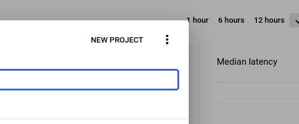

This repo runs an OpenID connect to SSH Certificate translation service
It relies on the apache2 mod_auth_openidc component https://github.com/zmartzone/mod_auth_openidc
We use OIDC to authenticate the user, then an OAuth2 Implicit resource API to allow the user/end application to generate a certificate
There are two configurations to perform:
1. The certificate authority. i.e. when user chris.hines@monash.edu turns up, what key will sign with and what username will we assign
2. The OAuth2 Implicit clients. The OAuth2 flow requires that we redirect the web browser to pass information. Since we don't want to pass information to an evesdropper, we restrict the valid URLs. This is what the clients are all about.

## Deployment (overview)

1. Create a VM with apache2 and mod_auth_openidc
2. Obtain OIDC credentials for google or okta or AAF
5. configure apache (use oidc.conf as an example, get your own client secret and ID)
2. create a python venv with uwsgi
3. create clients.yml (i.e. do configuration)
4. use run.sh to excute the uwsgi server
5. setup the CA and the list of authorized users
6. test it all


## Deployment (in detail, step by step)

### Creating the VM

1. Generate a CA key pair (or obtain the existing one)
2. login to the nectar dashboard. Ensure that the public part of the CA key pair is present
3. Launch a VM from the nectar dashboard. It should be
    - based on ubuntu 22.04
    - allow access to ports 443 and 80
    - use the public part of teh CA key pair
    - use the boot script
```
#!/bin/bash
sed -i 's/^ssh/cert-authority ssh/' /home/ubuntu/.ssh/authorized_keys
exit 0
```
4. Use the dashboard to create a DNS entry. Write down/remember the FQDN for subsequent steps (N.B. we will use letsencrypt so the FQDN must support the letsencrypt CA. monash.edu or massive.org.au domains will not work. cloud.edu.au domains will). In my case my FQDN is sshauthz0.monashhpc-ancillary.cloud.edu.au
5. Log into the node.
6. `sudo apt update ; sudo apt upgrade`
7. `sudo shutdown -r now` (might as well start fully up to date) 
8. Once its back `sudo apt install apache2 libapache2-mod-auth-openidc` `sudo apt install python3-certbot-apache` `sudo certbot -d <FQDN>`
9. Verify certbot worked by opening a web browser to https://<FQDN>
10. `sudo a2enmod auth_openidc` (it should say its already enabled)
11. `sudo a2enmod proxy proxy_http headers` It will tell you to reload apache. You can do this if you like but we've still got another step.

### Obtaining OIDC credentials

I recommend you read somewhere else for details of how OIDC works as I can't explain it as well as other people, however I can give a very brief overview:

OIDC relates to OAuth2 Code flows. This means that a user accessing our website (call it A) will recieve a browser redirect to the Identity Provider (eg google, call it B) The user will log into B and B will redirect back to A with a token. A will then use that token  plus a secret to obtain information about the identity of the user from B. In summary the user does not actually authenticate to our service. Rather they authenticate to google and get a token, then send the token to us. We then use the token to obtain their identity information from google.

The net result is that we will need
1. An OIDCClientID (provided by the IdP)
2. An OIDCClientSecret (provided by the IdP)
3. An OIDCRedirectURL (provided by us, given to the IdP)
4. An OIDCCryptoPasspharse (generated by us, random, not shared with anyone)

You should refer to https://github.com/zmartzone/mod_auth_openidc/ ... Google also offers good documentation

1. go to console.cloud.google.com ... ensure you are logged in with your Monash Account
2. click on this selector  Create a new project 
3. select credentials , then create credentials  and OAuth Client ID
4. tell google its a web application, give it a name and set the redirect URL 
  - the redirect url will be `https://<fqdn>/protected/callback` unless you know what your doing and want to change this of course.
5. On the next screen you will be showing your credentials (client ID and client secret. Just download the json file and save it somewhere, rather than copy pasting each value into a text editor


### Deploying the server

1. Copy oidc.conf from this git repo to teh new server. Put it in `/etc/apache2/confs-available/oidc.conf`
2. generate a random passphrase using `openssl rand -base64 36` this will be the value of OIDCCryptoPassphrase
2. edit the file `oidc.conf` filling in the OIDC values obtained above
3. `sudo a2enconf oidc` and `sudo systemctl restart apache2`
4. Clone this git repo onto the server
5. `sudo apt install python3-venv`
6. `sudo apt install gcc`
6. `sudo apt install python3-dev`
7. `python3 -m venv`
8. ` . ./venv/bin/activate ; pip install cython ; pip install uwsgi ; pip install flask flask-restful pyyaml pyjwt dateutils`
9. edit run.sh ... there is a line that says `-H /home/ubuntu/sshauthz/venv` change this to the path to the virtual environment you just created. There is also an argument `--configdir` which needs a similar update
10. `sudo apt install tmux` `tmux new-session` `. ./venv/bin/activate` `./run.sh` 
11. `./run.sh`


### Configure clients

`clients.yaml` contains a list of ... programs I guess, which the user is allowed to use to get a certificate. The important point is that each program includes a redirect URL. After usign the web browser to log in, the web browser calls this URL. That call is where the handoff to another program (such as ssossh or strudel2 or mytardis) happens. I've provided a clients.yml prepopulated for just ssossh.

### Setup the CA

Back on your computer, where you have the original CA public and private keys, you will need to generate a list principals. It will look something like

```
max_expiry: 86400
chris.hines@monash.edu:
  principals: ['chines','ubuntu','debian','ec2-user']
```
obviously extend with other users

In this repo you will also find a script called `create_ca.py`. Edit this script to set the FQDN of the server you are creating. Run with `python3 create_ca.py <caprivatekey> <principals file>`
You shoudl get a 200 message from the server
You should also find that there are now two new files on the server. They've got "random" names (its actually the base64 encoded fingerprint for the CA). Get that base64 string and copy to the clipboard/notepad

### Test


Grab a copy of https://gitlab.erc.monash.edu.au/hpc-team/ssossh
Generate the auth config. You will need
1. the fqdn
2. the fingerprint. You can get this by `ssh-keygen -l -f ca.pub` ... its JUST the middle value. Not the integer at the begining. Not the comment at the end
2. the base64 encoded fingerprint. use `echo -n <fp> | base64` ... note that the -n is important as ti tells echo not to output a trailing newline. We don't want the newline in the base64 encoding
Fill in the template with the above values
```
[

  {
    "authorise": "https://{{ FQDN }}/protected/authorize/{{ base64 }}",
    "client_id": "ssossh",
    "sign": "https://{{ FQDN }}/sshauthz/sign/{{ base64 }}",
    "logout": "https://{{ FQDN }}/protected/callback?logout=https%3A%2F%2Flocalhost%2F",
    "name": "M3 Admin",
    "icon": null,
    "scope": "user:email",
    "cafingerprint": "{{ fingerprint}}",
    "desc": ""
  }
]
```
Finally use python3 -m ssossh <configfilename>. At the end you should have a shiny new certificate


## How does it work?

The central idea is the command

```['ssh-keygen', '-s', ca, '-I', keyid, '-n', ','.join(set(principals)), '-V', "+{}s".format(str(int(period))), pubkeyfile.name]```

(ca, keyid and pubkeyfile.name are string variables, period is an integer, principals is a list of string representing the usernames)
This command uses the file ca (which is effectively the master key) to "Sign" a public key and turn it into a certificate. The certificate will be valid for `period` seconds, the certificate is valid for the users listed in principas. If you ever need to refer to this certificate (in for examlpe a key revocation list, you can refer to it by keyid (in this code I set keyid to be the fingerprint of the key)

The rest of the code is just ensures that you log in with okta/OpenID connect and translates one of the attributes (in this case email) into the list of valid users.

## SSH Agents and authsocks and config files

There are some warts around using ssh agents that might make you want to write some shell scripts for to make your life easier
One of the really annoying things is if you run a single agent and add too many certificates or keys to is (i.e. you admin too many different systems) you will start getting error messages from the ssh servers when you login. This is because an ssh server will let you try like 5 keys by default before it decides you're trying to brute force and shuts you down. So you may end up needing to run one agent per server. 

Thankfully on linux and mac its easy to run additional agents. Which agent you're using is easily controled by the environment varaible `$SSH_AUTH_SOCK`. You can also override it in your `~/.ssh/config` or on the command line with the option `-o IdentityAgent`

One trick I've got is a bash script
```
#!/bin/bash
ps aux | grep -i ssh-agent | grep mlerp_admin_socket
rv=$?
if [ $rv -eq 1 ]; then
    rm ~/.ssh/mlerp_admin_socket
    ssh-agent -a /home/chines/.ssh/mlerp_admin_socket
fi

export SSH_AUTH_SOCK=/home/chines/.ssh/mlerp_admin_socket
cd /home/chines/code/ssossh
python3 -m ssossh
```

and accompaning ssh config

```
Host admin-mlerp-login0
    User ubuntu
    IdentityAgent /home/chines/.ssh/mlerp_admin_socket
    HostName mlerp-login0.mlerp.cloud.edu.au
```

then I can always do ssh admin-mlerp-login0. it will always use the correct agent (without having to set environment variables in every terminal) and it already knows when I'm using "admin" to use the username ubuntu

Another option is to run
```
eval `ssh-agent`
```

(notice the forward ticks)
this starts ssh-agent and sets the SSH_AUTH_SOCK variable. But that gives you something isolated to that terminal (unless you copy paste the SSH_AUTH_SOCK variable into other terminals)
